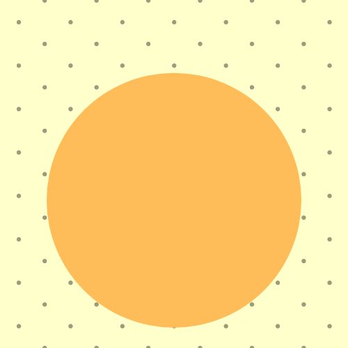

# Steanography
Code to add hidden messages to images. Inspired by my college Image Processing course. Based on the fact that two objects in a 8-bit grayscale image need a minimum 8 gray level difference to be distinuishable to humans.
 
 
 
<h3>Example</h3>
|||||||||||||||||||||||||||| Original Image |||||||||||||||||||||| ||||||||||||||||||||||| Modified Image |||||||||||||||||||||||| |||||||||||||||||||||||| Secret Code ||||||||||||||||||||||||

    
    
    

